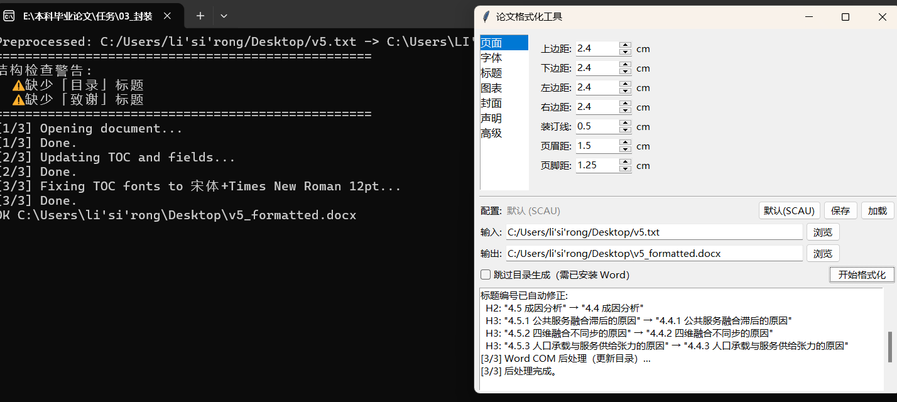

# 偷偷开源的排版工具

一键格式化毕业论文。双击 exe，选文件，点"开始格式化"，搞定。

默认配置为 **华南农业大学 2024 本科毕业论文** 格式规范，支持通过 YAML 配置文件适配其他学校。


## 功能

- GUI 界面，所有参数可视化调整
- 页面设置（页边距、装订线、页眉页脚）
- 字体字号（正文、各级标题、图表题、脚注）
- 自动生成封面和声明页（也支持上传自定义封面）
- 特殊标题格式化（摘要、目录、参考文献、致谢）
- 标题自动编号修正
- 题序与标题间距规范化
- 图表题注格式化 + 编号连续性检查
- 参考文献悬挂缩进
- 三线表格式
- 目录生成与字体修正（需 Word COM）
- 页码设置（前置罗马数字 + 正文阿拉伯数字）
- 引用逗号间距自动修正
- 配置保存/加载，方便分享给同校同学
- 参考文献交叉引用（编号制 `[1]` 自动生成 Word 域，支持删除文献后全局更新编号）
- 引用↔文献交叉检查（编号连续性、缺失条目、GB/T 7714 格式）

> **引用风格说明**：工具自动识别两种引用风格，请全文统一使用其中一种：
>
> | | 编号制 | 著者-年制 |
> |--|--------|-----------|
> | 正文写法 | `城乡融合[1]是...` | `城乡融合（张三，2024）是...` |
> | 文末格式 | `[1] 张三. 标题[J]. 期刊, 2024.` | `张三. 标题[J]. 期刊, 2024.`（无编号，按姓氏排序） |
> | 交叉引用 | 自动生成 Word SEQ/REF 域 | 不适用（无需编号联动） |
> | 更新方式 | 删除文献后 Ctrl+A → F9 | 手动增删即可 |
>
> SCAU 本科论文一般使用**编号制**。
> 小tips：在正文里面按住ctrl点击编号[1]可以自动跳转文末对应的参考文献
  
## 支持格式

| 输入格式 | 说明 | 额外依赖 |
|----------|------|----------|
| `.docx` | Word 文档 | 无 |
| `.doc` | 旧版 Word | 需本机安装 Microsoft Word |
| `.txt` | 纯文本 | 需 [pandoc](https://pandoc.org/) |
| `.md` | Markdown | 需 pandoc |
| `.tex` | LaTeX | 需 pandoc |

输出统一为 `.docx`。使用 `.txt`/`.md`/`.tex` 时，将 `pandoc.exe` 放在程序同目录或加入 PATH 即可。

## 下载使用

### 方式一：下载 exe（推荐）

从 [Releases](../../releases) 下载 `thesis-format.exe`，双击运行。

> 仅支持 Windows。Mac/Linux 用户需从源码运行（见下方）。

### 方式二：从源码运行

```bash
pip install -r requirements.txt
python thesis_format_cli.py
```

## 配置

默认使用华南农业大学 2024 规范。如需修改：

1. 点击 GUI 中的「保存配置」导出 `thesis_config.yaml`
2. 修改需要调整的参数
3. 点击「加载配置」导入修改后的文件

也可以命令行指定：

```bash
thesis-format.exe --input 论文.docx --config 我的学校.yaml
```

配置文件示例见 `defaults/scau_2024.yaml`。

## 打包 exe

```bash
build_exe.bat
```

需要安装 PyInstaller：`pip install pyinstaller`

## 文件说明

| 文件 | 说明 |
|------|------|
| `thesis_format_cli.py` | GUI 入口 |
| `thesis_format_2024.py` | 格式化核心引擎 |
| `thesis_config.py` | 配置加载器 + 内置默认值 |
| `word_postprocess.py` | Word COM 后处理（更新目录） |
| `preprocess_txt_to_md.py` | txt 预处理转 Markdown |
| `defaults/scau_2024.yaml` | 默认配置文件 |
| `defaults/scau_logo.png` | 学校 Logo |

## 示例文件

[`examples/`](examples/) 目录包含处理前后的对比示例：

| 文件 | 说明 |
|------|------|
| [`处理前示例.txt`](examples/处理前示例.txt) | 输入：纯文本论文 |
| [`处理后示例.docx`](examples/处理后示例.docx) | 输出：格式化后的 Word 文档 |

## 文档结构说明
https://github.com/153lsr/thesis-typeset/blob/main/STRUCTURE_GUIDE.md

## 界面概览


## License

GPL-3.0
